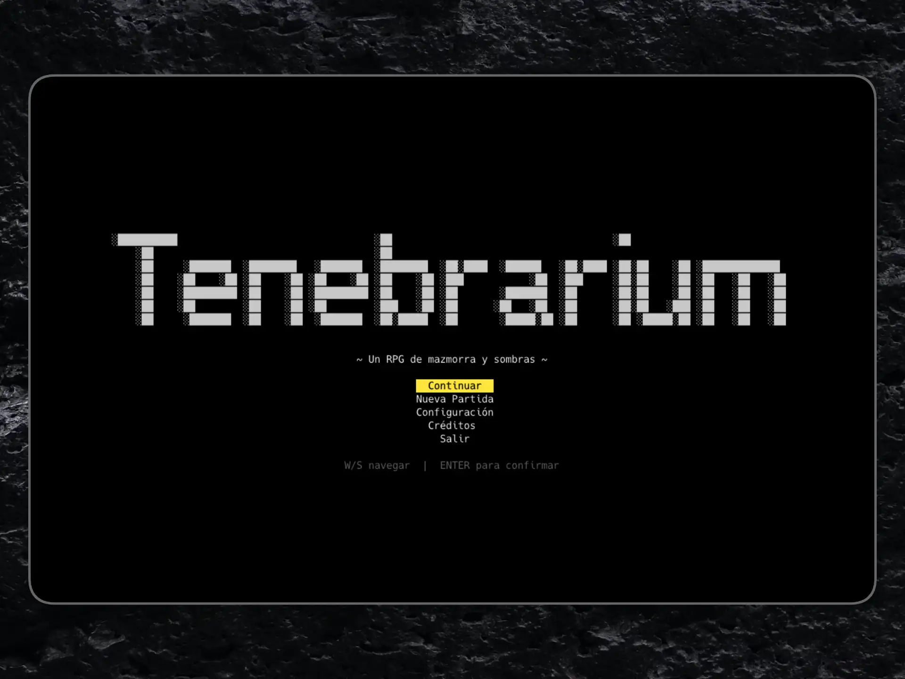
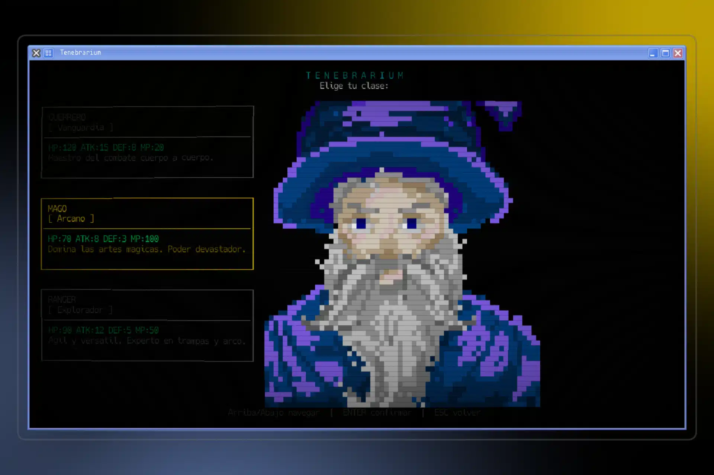
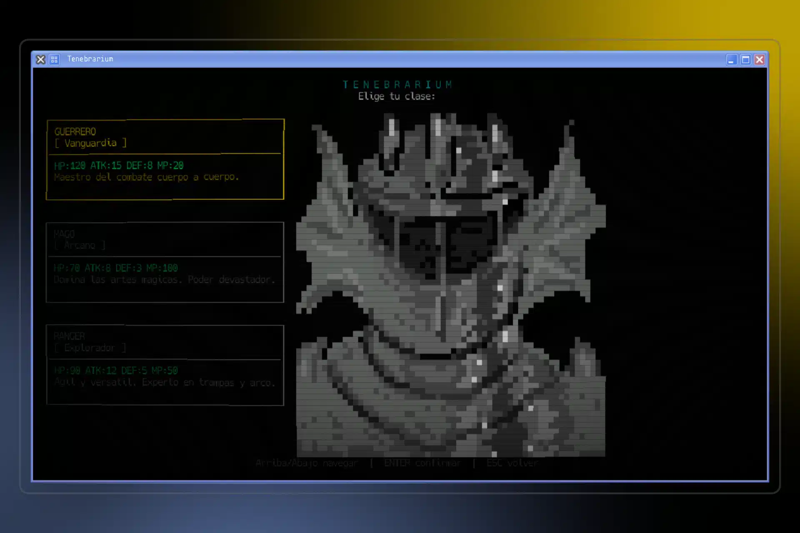
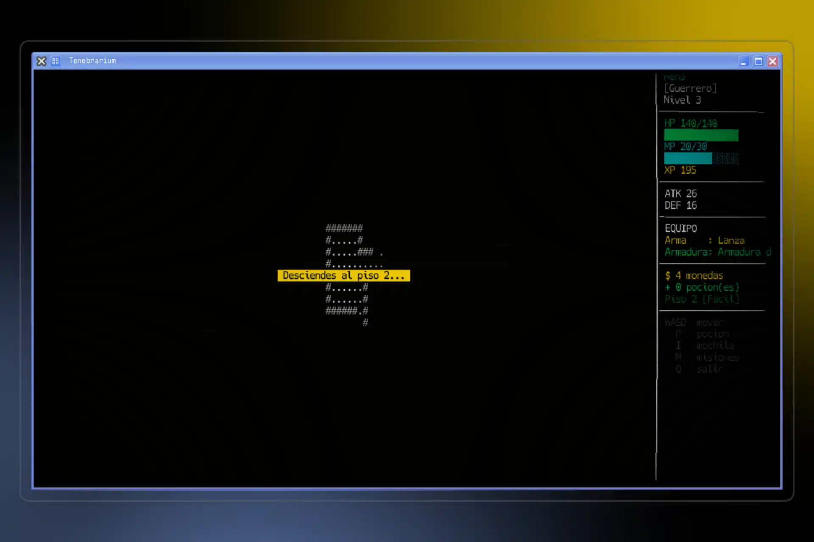
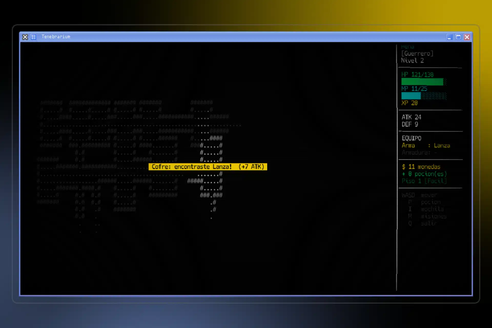
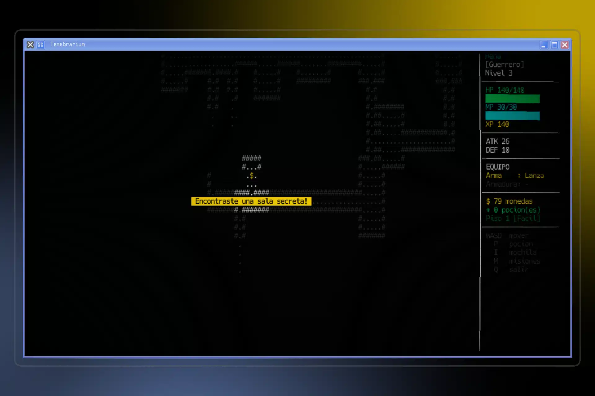

# Tenebrarium

RPG de mazmorras por turnos con estética TUI, ejecutable como aplicación nativa. Escrito en C++17 con Raylib.



## Características

- Ventana nativa (Linux / Windows) con fuente monoespaciada empaquetada
- Generación procedural de mazmorras (BSP) con campo de visión
- Combate por turnos con sistema de Puntos de Acción (3 PA por turno)
- 3 clases: Guerrero, Mago, Ranger — cada una con 3 artes únicas
- Inventario por slots, equipo, pociones, cofres, llaves y salas secretas
- Tienda con mercader por piso
- **20 pisos** con escalado de dificultad — jefes cada 5 pisos
- Diario de misiones
- Retratos de clase en truecolor (REXPaint `.xp`)
- 2 modos de HUD: panel lateral o barra inferior
- Zoom del mapa ajustable en tiempo real (`+` / `-`), se guarda entre sesiones
- Guardado automático al bajar de piso — continúa desde el menú principal

| | |
| --- | --- |
|  |  |

| | | |
| --- | --- | --- |
|  |  |  |

## Descarga

Descarga el ejecutable desde la [página de releases](../../releases/latest):

- **Linux** → `tenebrarium-linux.tar.gz` — extrae y ejecuta `./tenebrarium`
- **Windows** → `tenebrarium-windows.zip` — extrae y ejecuta `tenebrarium.exe`

> **Nota Windows:** requiere OpenGL 3.3. En VMs sin soporte, coloca `opengl32.dll` de [Mesa3D](https://fdossena.com/?p=mesa/index.frag) junto al `.exe`.

## Build & Run

**Dependencias del sistema:** `cmake` `zlib` `git`

```bash
# Arch Linux
sudo pacman -S cmake zlib git

# Compilar (descarga Raylib automáticamente la primera vez)
cmake -S . -B build -DCMAKE_BUILD_TYPE=Debug -DCMAKE_POLICY_VERSION_MINIMUM=3.5
cmake --build build -j$(nproc)

./build/tenebrarium
```

## Controles

### Exploración

| Tecla | Acción |
| --- | --- |
| `W A S D` / flechas / `H J K L` | Moverse |
| `E` | Buscar paredes secretas |
| `I` | Inventario |
| `M` | Diario de misiones |
| `Q` | Menú de salida |
| `+` / `-` | Zoom del mapa (1×–3×) |

### Combate

| Tecla | Acción | Coste |
| --- | --- | --- |
| `A` | Atacar | 1 PA |
| `F` | Ataque Fuerte | 2 PA |
| `D` | Defender | 1 PA |
| `U` | Usar poción | 1 PA |
| `H` | Menú de Artes | — |
| `Space` | Terminar turno | — |
| `R` | Huir | 3 PA |
| `Tab` | Cambiar objetivo | — |

## Estructura

```text
src/
  core/       Game loop, estados, input
  entities/   Player, Enemy
  combat/     CombatSystem, Arts, StatusEffects
  inventory/  Inventory, Item
  world/      Map, BSPDungeon, FOV
  ui/         Renderer, TerminalScreen, XpLoader
  quests/     Sistema de misiones
assets/
  fonts/      mono.ttf (Hack Regular)
  art/        Retratos .xp por clase (mago.xp, warrior.xp)
```
